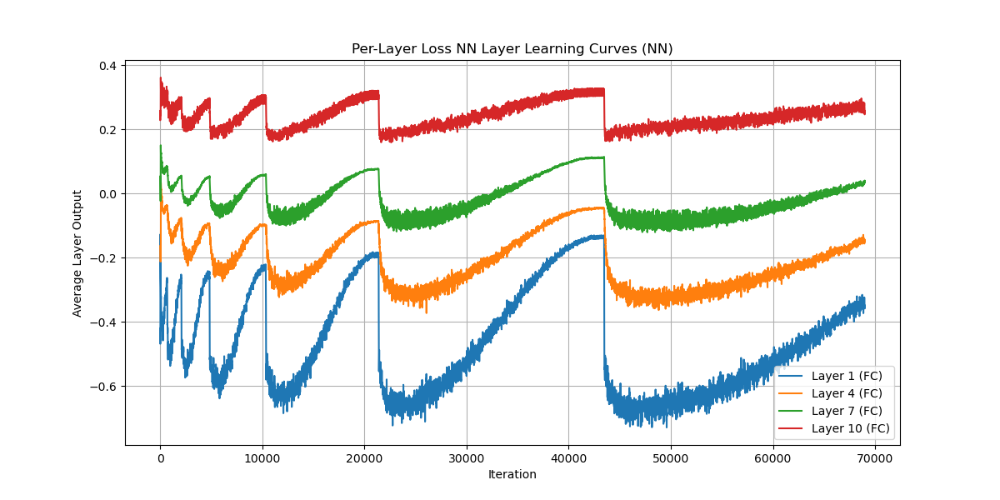
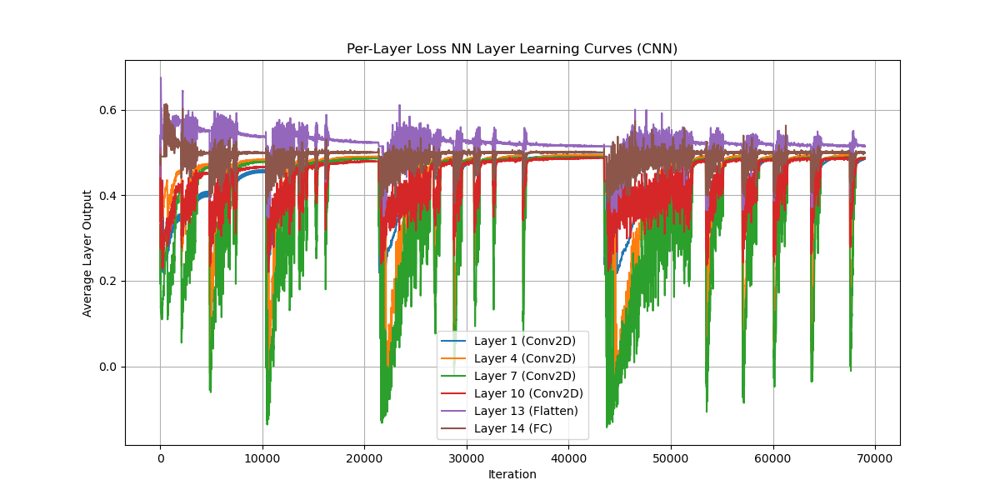
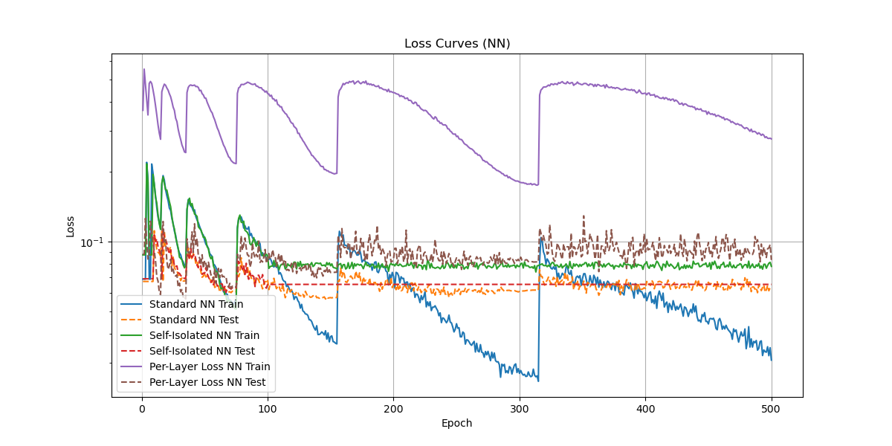
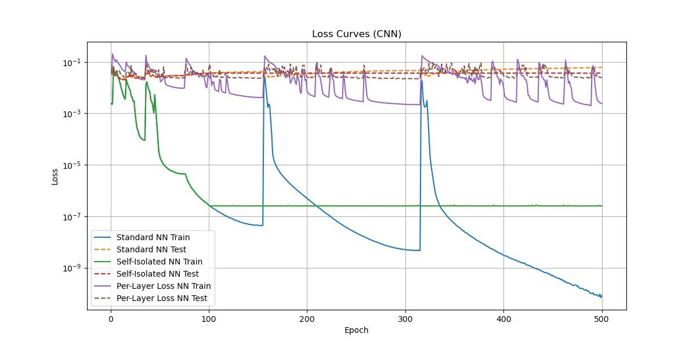
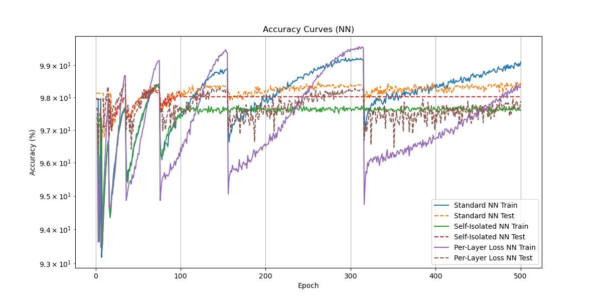
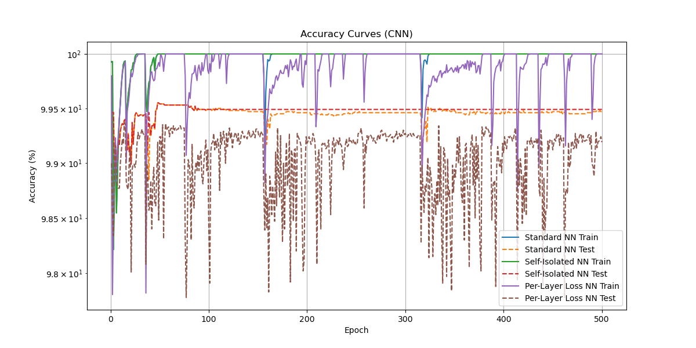

# Layer-Specific Loss Analysis in NN and CNN Architectures

## Overview
In this project I explore the learning dynamics and performance of Neural Networks (NNs) and Convolutional Neural Networks (CNNs) through analyzing their behavior under different experimental setups. I focus on how isolating layers or applying per-layer loss penalties affect overall model training and generalization. I experiment on the MNIST dataset. The goal is to examine per-layer outputs, loss, and accuracy trends across epochs, with a focus on determining the effectiveness of traditional training versus more complex strategies like layer isolation and per-layer loss.

## Experiments Conducted
1. **Standard NN/CNN**: Training the model using conventional backpropagation without any layer-specific interventions.
2. **Self-Isolated NN/CNN**: Layers are isolated after a certain epoch which is user defined, meaning that gradients are computed independently for each layer post-switch.
3. **Per-Layer Loss NN/CNN**: Here, a loss penalty is applied to intermediate layer outputs, which is factored into the total loss, encouraging each layer to match a predefined target.

## Key Results
- **NNs**: Standard training was consistently better than any other experiment, showing smoother loss curves and higher accuracy. 
- **CNNs**: CNNs demonstrated robustness in the isolated-layer experiment, showing that layer isolation might be more suited to convolutional architectures. However, standard CNN training still yielded the highest accuracy and the most stable learning behavior.
- **Note**: At times, the data demonstrated that per layer loss on CNNs converged to  higher accuracies quicker than standard CNN training. However, in prior lengthy experiments, isolated CNNs appear to match standard CNN training on accuracy, and are more robust of changes in training dynamics like a dynamic learning rate. More research should be done to check these in further depth.

## Insights
- **Standard Training**: Across both NN and CNN architectures, traditional end-to-end backpropagation resulted in the smoothest learning curves, the lowest loss, and the highest accuracy. The model's ability to propagate gradients across all layers without any restrictions ensures that feature learning happens hierarchically from low-level to high-level features.
- **Self-Isolation**: In NNs, self-isolation post-switch epoch introduced inconsistencies in learning, particularly in deeper layers, leading to diminished accuracy. However, in CNNs, this technique appeared to stabilize learning and reduce loss in specific layers, suggesting that isolating layers might be beneficial in models dealing with spatial feature extraction.
- **Per-Layer Loss**: The per-layer loss experiment led to erratic learning behavior in both NNs and CNNs. While the method provided insights into each layer’s performance, it complicated the overall learning process, often leading to suboptimal results, and difficult training requirements.

## Graphical Analysis

- **Layer Learning Curves**: 
  These graphs show how the outputs of each layer evolve during training. 
  In NNs, deeper layers generally show more stable learning, while in CNNs, convolutional layers learn more consistently from early epochs.
  
  - _**Figure 1: NN Layer Learning Curves**_

  

  - _**Figure 2: CNN Layer Learning Curves**_

  

- **Loss Curves**: The loss curves for both NNs and CNNs highlight the effectiveness of different training methods. Standard training exhibits the smoothest and most consistent reduction in loss. In contrast, self-isolated and per-layer loss methods lead to erratic fluctuations in loss values, particularly in NNs.
  
  - _**Figure 3: NN Loss Curves**_

  

  - _**Figure 4: CNN Loss Curves**_

  

- **Accuracy Curves**: Accuracy trends align with the loss curves, showing that standard training produces the best generalization. CNNs tend to perform better in accuracy compared to NNs under all experimental conditions, reinforcing the stability of convolutional architectures.
  
  - _**Figure 5: NN Accuracy Curves**_

  

  - _**Figure 6: CNN Accuracy Curves**_

  

## Conclusion
The experiments confirm that traditional backpropagation is the most effective training method for both NN and CNN architectures, providing the most stable learning curves, loss reductions, and accuracy gains. However, isolated layer methods and per-layer loss might have potential in specific cases, especially in convolutional networks where layer-wise independence can enhance certain learning dynamics.
The idea for these experiments came from discussions conducted with my good friend Vlad!
